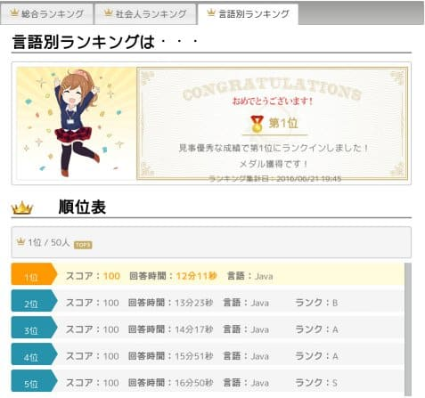

# 寄る年波には勝てません☕ 2023-01-14

2016年にpaizaのスキルチェックで言語別(Java)1位取ったときのスクリーンショットです。ランクCの簡単な問題だけど、簡単だからこそ上位取るのは難しいだろうなと頑張った結果です。

あれから約7年、思考もキーボード打つのも遅くなったなあと。後進に経験積ませようと譲ってきたことに後悔はありませんが一抹の寂しさも。もちろん成長した部分もあるわけですが。 
肩こりひどいわ。

今の paiza 単なる転職サイトではなく、e-learningも展開していて進化していますね。非プログラマの後輩たちがpaizaでプログラミングを勉強していると教えてくれました。体系的な学習は大切。

少し前に [paiza.io](https://paiza.io/) を使ってみました。昔は入門書以前に環境構築で挫折した人いたんだろうな。